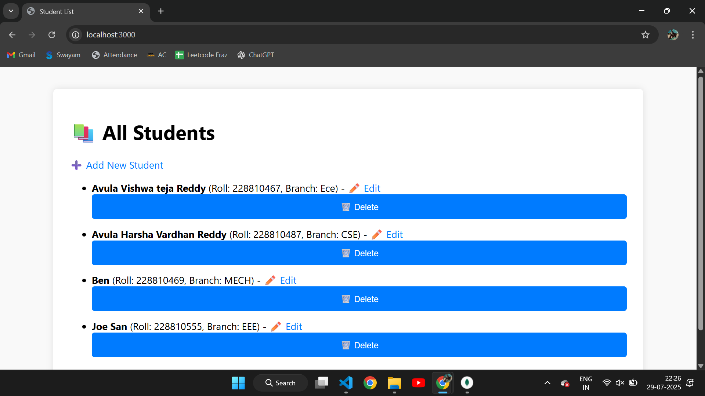
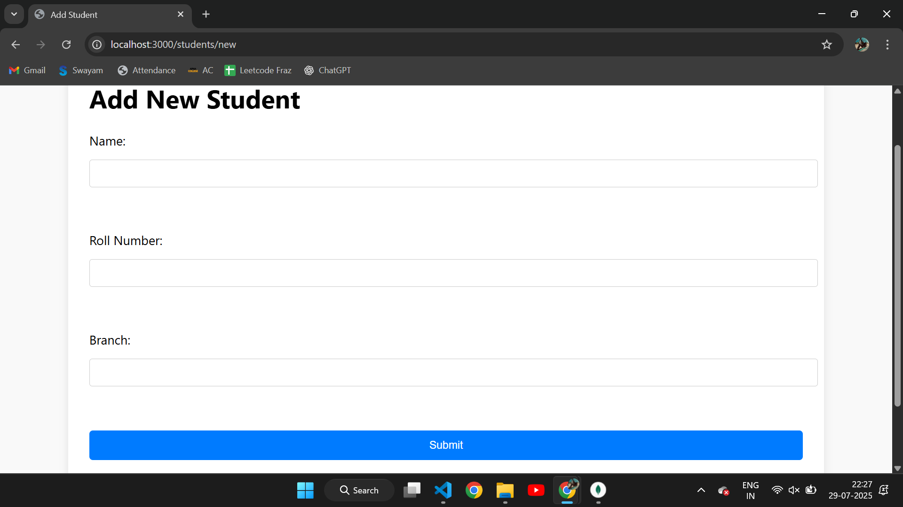
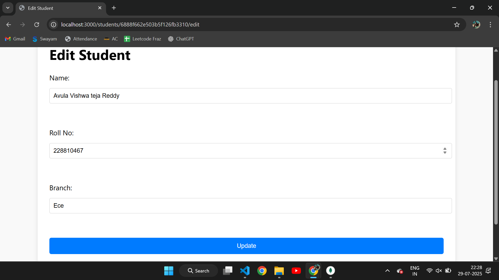

# Student Management CRUD App

A full-stack **CRUD** application to manage student records using:

- **Node.js**
- **Express.js**
- **MongoDB (with Mongoose)**
- **EJS Templating Engine**

This app allows you to **Create, Read, Update, and Delete** student records.

---

## 🔧 Features

- Add new students
- View all students
- Edit student details
- Delete a student
- Server-side rendering using EJS

## 📸 Screenshots

### 🏠 Home Page

### ➕ Add Student Page

### ✏️ Edit Student Form

